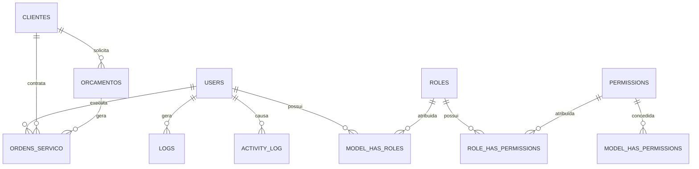

# 📊 Estrutura do Banco de Dados - Eletrônica Oriental

## Tabelas Principais

### `users`
- **Objetivo:** Armazena informações dos usuários do sistema (proprietários, técnicos, atendentes, etc.).
- **Campos principais:** `id`, `name`, `email`, `password`, `profile_photo_path`, `active`, `google_id`, etc.
- **Relacionamentos:**
  - Muitos-para-muitos com `roles` (permissões)
  - Um-para-muitos com `logs` (ações do usuário)
  - Um-para-muitos com `ordens_servico` (como técnico)
  - Um-para-muitos com `activity_log` (como causer)

---

### `roles`
- **Objetivo:** Define papéis/permissões dos usuários (ex: admin, proprietario, tecnico, atendente).
- **Relacionamentos:** Muitos-para-muitos com `users`.

---

### `clientes`
- **Objetivo:** Armazena informações dos clientes da empresa.
- **Campos principais:** `id`, `nome`, `email`, `telefone`, `endereco`, `cidade`, `estado`, `cep`, `cpf_cnpj`, `observacoes`, `ativo`.
- **Relacionamentos:**
  - Um-para-muitos com `orcamentos`
  - Um-para-muitos com `ordens_servico`

---

### `orcamentos`
- **Objetivo:** Representa orçamentos realizados para clientes.
- **Campos principais:** `id`, `cliente_id`, `numero`, `descricao`, `valor_total`, `status`, `data_criacao`, `data_validade`, `observacoes`.
- **Relacionamentos:**
  - Muitos-para-um com `clientes`
  - Um-para-muitos com `ordens_servico`

---

### `ordens_servico`
- **Objetivo:** Representa ordens de serviço para reparos e manutenções.
- **Campos principais:** `id`, `numero`, `cliente_id`, `tecnico_id`, `equipamento`, `marca`, `modelo`, `numero_serie`, `defeito_relatado`, `defeito_encontrado`, `solucao_aplicada`, `pecas_utilizadas`, `valor_mao_obra`, `valor_pecas`, `valor_total`, `status`, `data_entrada`, `data_saida`, `garantia_dias`, `observacoes`.
- **Relacionamentos:**
  - Muitos-para-um com `clientes`
  - Muitos-para-um com `users` (tecnico_id)
  - Muitos-para-um com `orcamentos`

---

### `logs`
- **Objetivo:** Armazena logs de atividades e erros do sistema.
- **Campos principais:** `id`, `level`, `message`, `context`, `file`, `line`, `trace`, `ip_address`, `user_agent`, `user_id`.
- **Relacionamentos:** Muitos-para-um com `users`.

---

### `activity_log`
- **Objetivo:** Armazena logs detalhados de atividades do sistema para auditoria e rastreabilidade de ações dos usuários.
- **Campos principais:**
  - `id`: Identificador único do log
  - `log_name`: Nome do log (ex: default)
  - `description`: Descrição da atividade (ex: "Cliente criado")
  - `subject_id`: ID do modelo afetado (ex: cliente, orçamento, ordem de serviço)
  - `subject_type`: Tipo do modelo afetado (ex: App\Models\Cliente)
  - `causer_id`: ID do usuário que realizou a ação
  - `causer_type`: Tipo do usuário (ex: App\Models\User)
  - `properties`: Dados adicionais da ação (JSON)
  - `created_at`, `updated_at`: Datas de criação e atualização
- **Relacionamentos:**
  - Muitos-para-um com `users` (causer_id)
  - Muitos-para-um com qualquer modelo do sistema (subject_id/subject_type)

---

## Tabelas de Controle e Sistema

### `permissions`
- **Objetivo:** Define permissões específicas do sistema (Spatie Laravel-permission).
- **Relacionamentos:** Muitos-para-muitos com `roles` e `users`.

### `model_has_roles`
- **Objetivo:** Tabela pivot que relaciona usuários com suas roles.
- **Campos principais:** `role_id`, `model_type`, `model_id`.

### `model_has_permissions`
- **Objetivo:** Tabela pivot que relaciona usuários/roles com permissões.
- **Campos principais:** `permission_id`, `model_type`, `model_id`.

### `role_has_permissions`
- **Objetivo:** Tabela pivot que relaciona roles com permissões.
- **Campos principais:** `permission_id`, `role_id`.

---

## Tabelas Auxiliares e de Controle

- **sessions, password_reset_tokens:** Controle de sessão e recuperação de senha.
- **personal_access_tokens:** Tokens de acesso para API.
- **cache, cache_locks:** Sistema de cache do Laravel.
- **jobs, failed_jobs, job_batches:** Sistema de filas do Laravel.

---

## Diagrama de Relacionamentos (ER)



## Principais Mudanças Recentes

### ✅ Novos Campos Adicionados:
1. **`users.google_id`** - Suporte a autenticação Google
2. **`users.profile_photo_path`** - Foto do perfil
3. **`users.active`** - Status ativo/inativo
4. **`clientes.ativo`** - Status ativo/inativo do cliente
5. **`ordens_servico.garantia_dias`** - Dias de garantia do serviço
6. **`ordens_servico.observacoes`** - Observações detalhadas

### ✅ Novas Tabelas:
1. **`activity_log`** - Logs detalhados de atividades
2. **`permission_tables`** - Sistema de permissões Spatie
3. **`clientes`** - Gestão de clientes
4. **`orcamentos`** - Gestão de orçamentos
5. **`ordens_servico`** - Gestão de ordens de serviço

### ✅ Relacionamentos Implementados:
1. **Clientes** têm relacionamento com **Orçamentos**
2. **Clientes** têm relacionamento com **Ordens de Serviço**
3. **Orçamentos** podem gerar **Ordens de Serviço**
4. **Usuários** (técnicos) executam **Ordens de Serviço**
5. **Sistema de Logs** rastreia todas as atividades

### ✅ Sistema de Permissões:
1. **Roles Implementadas:**
   - **admin**: Acesso completo ao sistema
   - **proprietario**: Gestão de clientes, orçamentos e ordens de serviço
   - **tecnico**: Execução de serviços e reparos
   - **atendente**: Atendimento ao cliente e gestão básica

2. **Funcionalidades de Segurança:**
   - Controle de acesso baseado em roles
   - Logs detalhados de atividades
   - Auditoria completa de ações
   - Proteção CSRF em formulários
   - Validação de dados via Form Requests

3. **Campos de Auditoria:**
   - **Activity Log**: Rastreamento completo de ações
   - **Logs de Sistema**: Logs de erros e atividades
   - **Timestamps**: Controle de criação e atualização
   - **User Tracking**: Identificação do usuário que realizou a ação

## Status dos Relacionamentos

### ✅ Implementados:
- ✅ Cliente → Orçamentos (1:N)
- ✅ Cliente → Ordens de Serviço (1:N)
- ✅ Orçamento → Ordens de Serviço (1:N)
- ✅ Usuário → Ordens de Serviço (1:N) - como técnico
- ✅ Usuário → Logs (1:N)
- ✅ Usuário → Activity Log (1:N) - como causer

### 🔄 Em Desenvolvimento:
- 🔄 Relacionamentos com peças utilizadas
- 🔄 Relacionamentos com garantias
- 🔄 Relacionamentos com histórico de serviços
- 🔄 Relacionamentos com anexos/documentos

## Índices Recomendados

### Performance:
```sql
-- Clientes
CREATE INDEX idx_clientes_ativo ON clientes(ativo);
CREATE INDEX idx_clientes_email ON clientes(email);
CREATE INDEX idx_clientes_cpf_cnpj ON clientes(cpf_cnpj);

-- Orçamentos
CREATE INDEX idx_orcamentos_cliente_id ON orcamentos(cliente_id);
CREATE INDEX idx_orcamentos_status ON orcamentos(status);
CREATE INDEX idx_orcamentos_data_criacao ON orcamentos(data_criacao);

-- Ordens de Serviço
CREATE INDEX idx_ordens_servico_cliente_id ON ordens_servico(cliente_id);
CREATE INDEX idx_ordens_servico_tecnico_id ON ordens_servico(tecnico_id);
CREATE INDEX idx_ordens_servico_status ON ordens_servico(status);
CREATE INDEX idx_ordens_servico_data_entrada ON ordens_servico(data_entrada);

-- Activity Log
CREATE INDEX idx_activity_log_causer_id ON activity_log(causer_id);
CREATE INDEX idx_activity_log_subject_id ON activity_log(subject_id);
CREATE INDEX idx_activity_log_created_at ON activity_log(created_at);
```

### Segurança:
```sql
-- Logs
CREATE INDEX idx_logs_user_id ON logs(user_id);
CREATE INDEX idx_logs_level ON logs(level);
CREATE INDEX idx_logs_created_at ON logs(created_at);
```

## Próximas Implementações

### 🔮 Planejadas:
1. **Tabela de Peças/Componentes**
   - Controle de estoque
   - Preços de peças
   - Fornecedores

2. **Tabela de Garantias**
   - Controle de garantias por serviço
   - Histórico de garantias
   - Alertas de garantia

3. **Tabela de Anexos**
   - Documentos de clientes
   - Fotos de equipamentos
   - Orçamentos em PDF

4. **Tabela de Histórico**
   - Histórico de alterações
   - Versionamento de dados
   - Auditoria completa

### 🎯 Objetivos:
- **Escalabilidade**: Estrutura preparada para crescimento
- **Performance**: Índices otimizados para consultas frequentes
- **Segurança**: Logs e auditoria completos
- **Manutenibilidade**: Estrutura clara e bem documentada 
